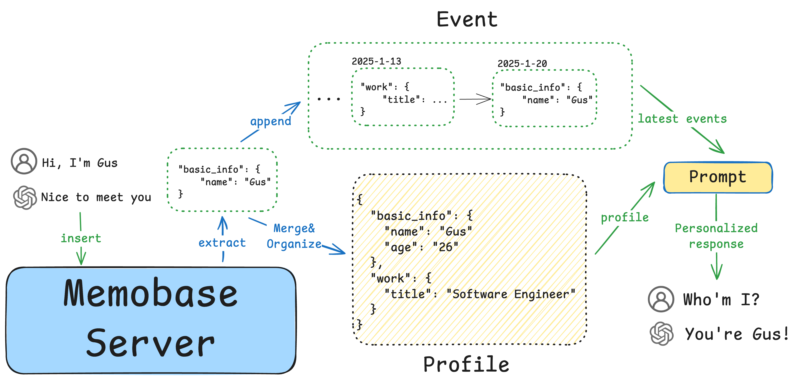

<div align="center">
    <a href="https://memobase.io">
    <picture>
      
    </picture>
  </a>
  <p>
    =3.11-blue">
    <a href="https://pypi.org/project/memobase/">
      
    </a>
    <a href="https://www.npmjs.com/package/@memobase/memobase">
      
    </a>
    <a href="https://jsr.io/@memobase/memobase">
      
    </a>
    <a href="https://github.com/memodb-io/memobase/actions/workflows/publish.yaml">
      
    </a>
  </p>
</div>


Memobase is a **user profile-based memory system** designed to bring long-term user memory to your Generative AI (GenAI) applications. Whether you're building virtual companions, educational tools, or personalized assistants, Memobase empowers your AI to **remember**,  **understand**, and **evolve** with your users.


Memobase can provide you structured user profiles of users, check out the [result](./docs/experiments/900-chats/readme.md) from a 900-turns real-world chatting:


<details>
<summary>Profile Output</summary>


```python
{
  "basic_info": {
    "language_spoken": ["English", "Korean"],
    "name": "오*영"
  },
  "demographics": {
    "marital_status": "married"
  },
  "education": {
    "notes": "Had an English teacher who emphasized capitalization rules during school days",
    "major": "국어국문학과 (Korean Language and Literature)"
  },
  "interest": {
    "games": 'User is interested in Cyberpunk 2077 and wants to create a game better than it',
    'youtube_channels': "Kurzgesagt",
    ...
  },
  "psychological": {...},
  'work': {'working_industry': ..., 'title': ..., },
  ...
}
```

</details>

## Core Features

- **🎯 Memory for User, not Agent**: Define and control exactly what user information your AI captures. 
- **🔄 Scalable Profiling**: User profiles evolve naturally through conversation with controllable memory size. 
- **🔌 Easy Integration**: Minimal code changes to integrate with your existing LLM stack with API, Python/Node SDK.
- **⚡️ Batch Processing**: Industry-leading speeds via non-embedding system and session buffer. Fast & Cheap.
- **🚀 Production Ready**: Battle-tested by our partners in production.


<div align="center">
    <picture>
      
    </picture>
  <p>How Memobase works?</p>
</div>


## Get Started

1. [Start your Memobase Backend](./src/server/readme.md), you should have the below two things to continue:
   1. A project url. default to `http://localhost:8019` 

   2. A project token. default to `secret`

2. Install the Python SDK: `pip install memobase`

3. Get ready to make AI remember your users now.


Here's a step-by-step guide and breakdown for you. 

> [!TIP]
>
> You can use [this quick start script](./assets/quickstart.py). Or you can keep things super easy by using [OpenAI SDK with Memobase.](https://docs.memobase.io/features/openai)

### 1. Make sure you're connected

 ```python
 from memobase import MemoBaseClient, ChatBlob
 
 mb = MemoBaseClient("http://localhost:8019", "secret")
 assert mb.ping()
 ```

### 2. Manage Users

```python
uid = mb.add_user({"any_key": "any_value"})
mb.update_user(uid, {"any_key": "any_value2"})
u = mb.get_user(uid)
print(u)

# mb.delete(uid)
```

### 3. Insert Data

> In Memobase, all types of data are blobs to a user that can insert, get and delete:

```python
messages = [
  {
      "role": "user",
      "content": "Hello, I'm Gus",
  },
  {
      "role": "assistant",
      "content": "Hi, nice to meet you, Gus!",
  }
]
bid = u.insert(ChatBlob(messages=messages))
print(u.get(bid)) # not found once you flush the memory.

# u.delete(bid)
```

> Be default, Memobase will remove the blobs once they're processed. This means that apart from the relevant memory, your data will not be stored with Memobase. You can persist the blobs by adjusting the [configuration file](https://docs.memobase.io/features/customization/full#storage-config).

### 4. Get your Memory

```python
u.flush()
```

And what will you get?

```python
print(u.profile())
# [UserProfile(topic="basic_info", sub_topic="name", content="Gus",...)]
```

`u.profile()` will return a list of profiles that are learned from this user, including `topic`, `sub_topic` and `content`. As you insert more blobs, the profile will become better.

<details>
<summary> Why need a flush?</summary>

In Memobase, we don't memoize users in [hot path](https://langchain-ai.github.io/langgraph/concepts/memory/#writing-memories-in-the-hot-path). We use buffer zones for the recent inserted blobs.

When the buffer zone becomes too large (e.g., 1024 tokens) or remains idle for an extended period (e.g., 1 hour), Memobase will flush the entire buffer into memory.  Alternatively, you can use `flush()` manually decide when to flush, such as when a chat session is closed in your app.
</details>


## Why/Where should I use Memobase?

### Remember the users 

By placing profiles into your AI (*e.g.* system prompt).

<details>
<summary>Demo</summary>


```python
PROFILES = "\n".join([p.describe for p in u.profile()])

print(PROFILES)
# basic_info: name - Gus
# basic_info: age - 25
# ...
# interest: foods - Mexican cuisine
# psychological: goals - Build something that maybe useful
# ...
```

</details>

### User analysis and tracking

Too much information is hidden in the conversations between users and AI, that's why you need a new data tracking method to record user preference and behavior.

<details>
<summary>Demo</summary>


```python
PROFILES = u.profile()

def under_age_30(p):
  return p.sub_topic == "age" and int(p.content) < 30

def love_cat(p):
  return p.topic == "interest" and p.sub_topic == "pets" and "cat" in p.content

is_user_under_30 = (
    len([p for p in profiles if under_age_30(p)]) > 0
)
is_user_love_cat = (
  len([p for p in profiles if love_cat(p)]) > 0
)                       
...
```
</details>

### Sell something to your customers.  

Not everyone is looking for Grammarly, it's always nice to sell something your users might want. 

<details>
<summary>Demo</summary>


```python
def pick_an_ad(profiles):
  work_titles = [p for p in profiles if p.topic=="work" and p.sub_topic=="title"]
  if not len(work_titles):
    return None
  wt = work_titles[0].content
  if wt == "Software Engineer":
    return "Deep Learning Stuff"
  elif wt == "some job":
    return "some ads"
  ...
```
</details>


## Documentation

For detailed usage instructions, visit the [documentation](https://docs.memobase.io/). 


## Stay Updated

Star Memobase on Github to support and receive instant notifications!


## Support

Join the community for support and discussions:

-  [Join our Discord](https://discord.gg/YdgwU4d9NB) 👻 

- [Follow us on Twitter](https://x.com/memobase_io) 𝕏 

Or Just [email us](mailto:contact@memobase.io) ❤️


## License

This project is licensed under the Apache 2.0 License - see the [LICENSE](https://github.com/memodb-io/memobase/blob/main/LICENSE) file for details.
